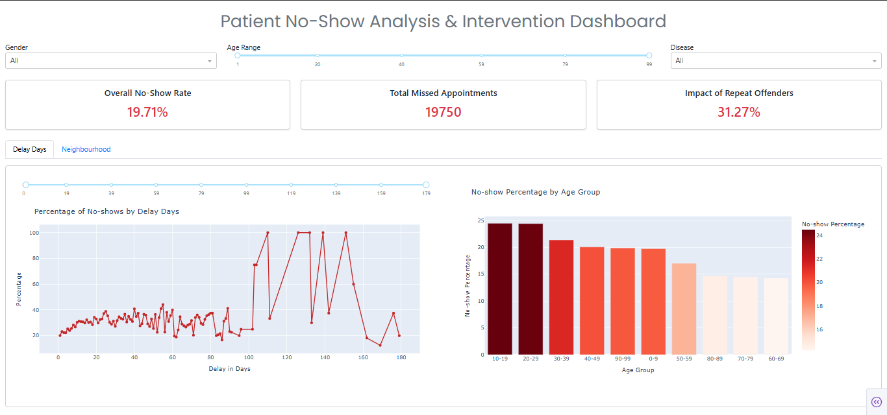

# Patient No-Show Analysis & Intervention Dashboard

A professional-grade interactive dashboard built using **Dash**, **Plotly**, and **Bootstrap**, designed for healthcare data analysts and decision-makers to monitor and reduce medical appointment no-shows through intelligent visualizations and actionable insights.

---

## 🚀 Key Features

- 📈 **Dynamic KPIs**: Real-time metrics for no-show rates, repeat offenders, and delay effects.
- 📊 **Interactive Visuals**:
  - Delay vs. No-Show Analysis
  - Age Group Trends
  - Neighbourhood Segmentation
- 🧠 **Embedded Controls**:
  - Dropdown in-bar chart with no UI overlap
  - Top-N adjustable visual ranking
- 🎯 **Targeted Demographics**: Easily identify high-risk groups (e.g., age 10–29 with long delays).

---

## 🧱 Tech Stack

- **Dash** (Plotly) for web interface
- **Dash Bootstrap Components** for responsive layout
- **Pandas / NumPy** for data handling
- **Plotly Express** for modern, clean visualizations

---

## 🗂 Project Structure

```
project/
│
├── data/
│   ├── KaggleV2-May-2016.csv    # Raw dataset
│   ├── insights.ipynb           # assumptions
│   └── app.ipynb                # Jupyter EDA
│
├── data.csv                    # Cleaned dataset used by dashboard
├── app.py                      # Main dashboard application
└── README.md 
```

---

## ⚙️ Setup Instructions

### 1. Clone the Repository

```bash
git clone https://github.com/MaroWael/patient-no-show-dashboard noshow-dashboard
cd noshow-dashboard
```

### 2. Environment Setup

```bash
python -m venv venv
source venv/bin/activate     # Windows: venv\Scripts\activate
pip install -r requirements.txt
```

Or manually:

```bash
pip install dash dash-bootstrap-components pandas plotly numpy
```

### 3. Run the App

```bash
python app.py
```

Open your browser at `http://127.0.0.1:8050`

---

## 📊 Dataset Overview

- **Patient Features**:
  - Gender, Age, Neighbourhood, Diseases (Hypertension, Diabetes, etc.)
- **Operational Features**:
  - Appointment Date vs. Scheduled Date (→ Delay)
  - No-show Indicator
- **Engineered Features**:
  - Delay_Days, AgeGroup, Risk Segment Flags

Original Dataset: [Kaggle - No-Show Appointments](https://www.kaggle.com/datasets/joniarroba/noshowappointments)

---

## 🧭 Dashboard Navigation

- **Filters**: Gender, Age Range, Disease toggles
- **Visuals**: Delay effects, Age groups, Neighbourhoods
- **Insights**: High-risk cohort flags, customizable charts

---

## 📸 Screenshot



---

## 📄 License

Licensed under the **MIT License** — use freely with attribution.

---

## 🙌 Credits

- Dashboard: [Plotly Dash](https://dash.plotly.com/)
- Styling: [Dash Bootstrap Components](https://dash-bootstrap-components.opensource.faculty.ai/)
- Data Source: [Kaggle](https://www.kaggle.com/datasets/joniarroba/noshowappointments)